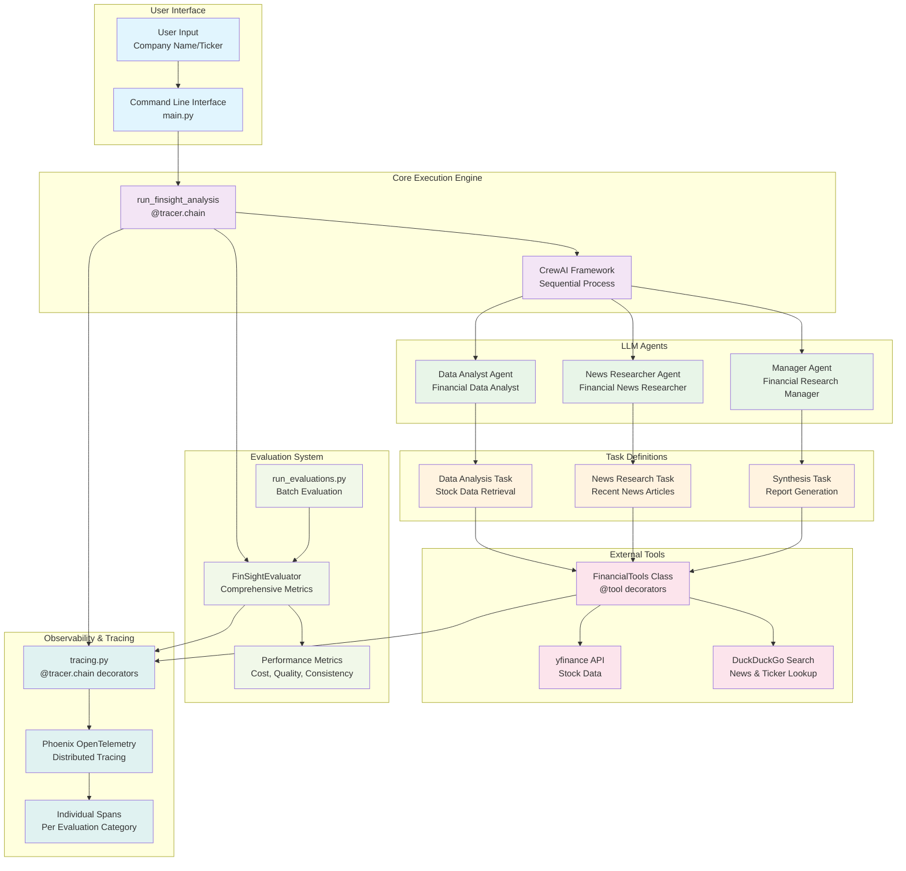

# FinSight Architecture Diagram

## System Overview

FinSight is a multi-agent financial research system that combines LLM agents, external APIs, and comprehensive evaluation frameworks to generate financial research reports.

## Architecture Components

## Detailed Component Breakdown

### 1. User Interface Layer
- **Entry Point**: `main.py` - Command line interface
- **Input**: Company name or ticker symbol
- **Output**: Comprehensive financial research report

### 2. Core Execution Engine
- **CrewAI Framework**: Orchestrates multi-agent workflow
- **Sequential Process**: Agents execute tasks in order
- **Error Handling**: Graceful failure management with retry limits

### 3. LLM Agents (agents.py)

#### Data Analyst Agent
- **Role**: Financial Data Analyst
- **Goal**: Fetch and analyze stock market data
- **Tools**: `get_stock_data`, `get_ticker_symbol`
- **Error Handling**: Failure-aware with clear error reporting

#### News Researcher Agent
- **Role**: Financial News Researcher
- **Goal**: Find relevant recent news articles
- **Tools**: `get_recent_news`
- **Rate Limiting**: Built-in delays to avoid API limits

#### Manager Agent
- **Role**: Financial Research Manager
- **Goal**: Synthesize data into comprehensive reports
- **No Tools**: Pure reasoning and synthesis

### 4. Task Definitions (tasks.py)

#### Data Analysis Task
- **Input**: Company name/ticker
- **Process**: Lookup ticker → Fetch stock data
- **Output**: Structured financial metrics
- **Max Retries**: 2 (prevents infinite loops)

#### News Research Task
- **Input**: Company name
- **Process**: Search for recent financial news
- **Output**: Summarized news articles
- **Focus**: Financially relevant content only

#### Synthesis Task
- **Input**: Data analysis + News research
- **Process**: Combine quantitative + qualitative data
- **Output**: Professional financial report
- **Structure**: Executive summary, financial position, news analysis, insights, risks

### 5. External Tools (tools.py)

#### FinancialTools Class
- **Decorators**: `@tool`, `@tracer.chain`
- **Timeout Handling**: 60-second execution limits
- **Error Handling**: Comprehensive error reporting

#### Stock Data Tool (`get_stock_data`)
- **API**: yfinance
- **Data**: Price, market cap, P/E ratio, dividend yield
- **Error Handling**: Graceful fallback for missing data

#### Ticker Lookup Tool (`get_ticker_symbol`)
- **API**: DuckDuckGo Search
- **Process**: Regex pattern matching
- **Fallback**: Manual extraction guidance

#### News Search Tool (`get_recent_news`)
- **API**: DuckDuckGo News
- **Filtering**: Financial relevance
- **Rate Limiting**: 1.5-second delays

### 6. Evaluation Framework (evaluations.py)

#### FinSightEvaluator Class
- **Enhanced Mode**: Comprehensive metrics with TextBlob
- **Fallback Mode**: Simplified metrics when dependencies missing
- **Metrics**: Performance, cost, quality, consistency

#### Evaluation Metrics

##### Performance Metrics
- **Response Time**: Excellent (≤30s), Good (≤60s), Poor (≤120s), Unacceptable (>120s)
- **Scoring**: 1.0, 0.8, 0.5, 0.2 respectively

##### Cost Efficiency
- **Token Counting**: Input + output tokens
- **Cost Estimation**: GPT-4 ($0.03/$0.06 per 1K tokens)
- **Scoring**: Excellent (≤$0.05), Good (≤$0.10), Poor (≤$0.20), Expensive (>$0.20)

##### Content Quality
- **Sentiment Analysis**: TextBlob polarity scoring
- **Readability**: Flesch Reading Ease score
- **Structure**: Section completeness and organization
- **Scoring**: Based on sentiment, readability, and structure quality

##### Consistency Testing
- **Multi-run Analysis**: 3 consecutive runs
- **Variance Calculation**: Standard deviation of scores
- **Scoring**: Excellent (≤0.1), Good (≤0.2), Poor (≤0.3), Inconsistent (>0.3)

### 7. Observability & Tracing (tracing.py)

#### Phoenix OpenTelemetry Integration
- **Distributed Tracing**: End-to-end request tracking
- **Span Creation**: Individual spans for each evaluation category
- **Performance Monitoring**: Response time and cost tracking
- **Error Tracking**: Comprehensive error reporting and debugging

#### Tracing Decorators
- **@tracer.chain**: Automatic span creation for function chains
- **Custom Spans**: Individual spans for evaluation metrics
- **Context Propagation**: Maintains trace context across function calls

## Data Flow

1. **User Input**: Company name or ticker via CLI
2. **Core Execution**: CrewAI orchestrates agent workflow
3. **Agent Processing**: Sequential execution of specialized agents
4. **Task Execution**: Specific tasks for data gathering and analysis
5. **Tool Integration**: External APIs for real-time data
6. **Report Generation**: Synthesis of quantitative and qualitative data
7. **Evaluation**: Comprehensive metrics and performance analysis
8. **Tracing**: Distributed tracing for observability and debugging

## Key Features

- **Multi-Agent Architecture**: Specialized agents for different aspects of financial analysis
- **Comprehensive Evaluation**: Performance, cost, quality, and consistency metrics
- **Observability**: Distributed tracing with Phoenix OpenTelemetry
- **Error Handling**: Graceful failure management with retry limits
- **Rate Limiting**: Built-in delays to respect API limits
- **Modular Design**: Clean separation of concerns across components 